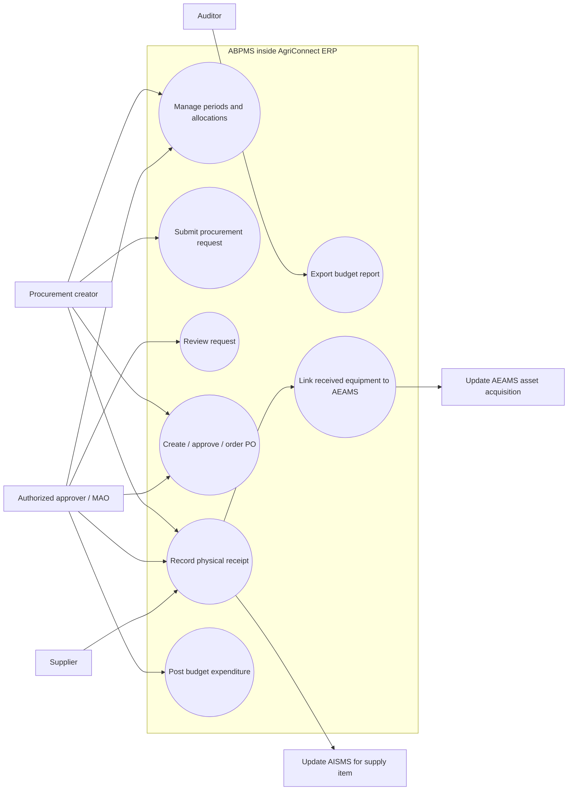
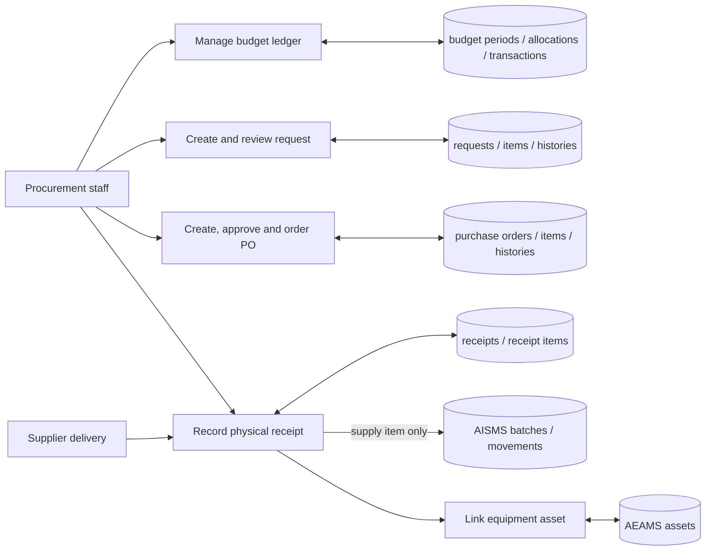
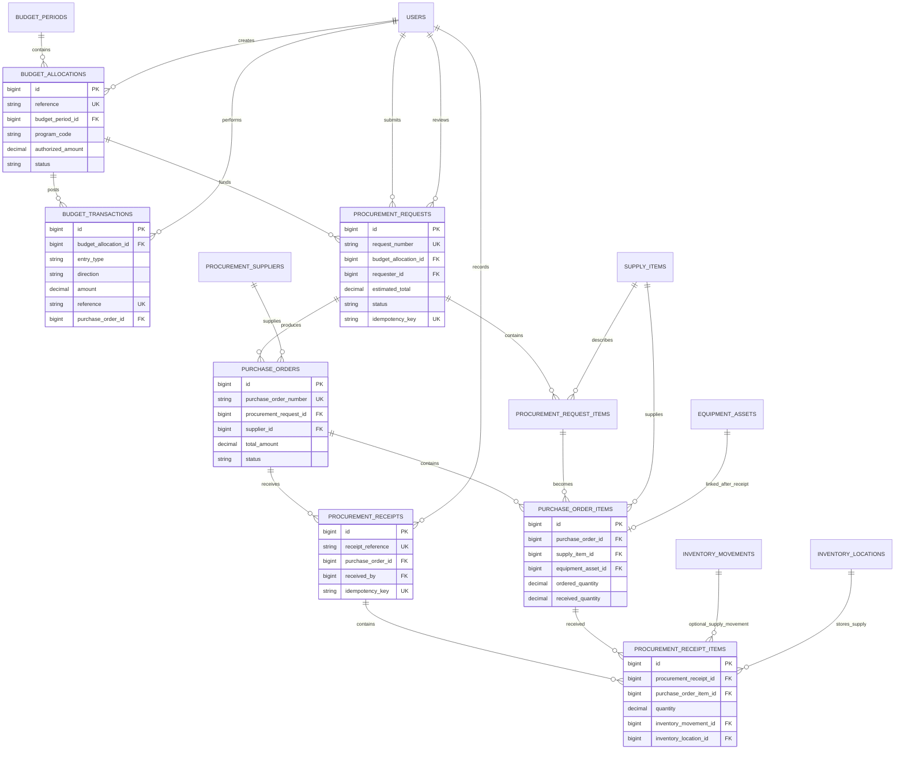
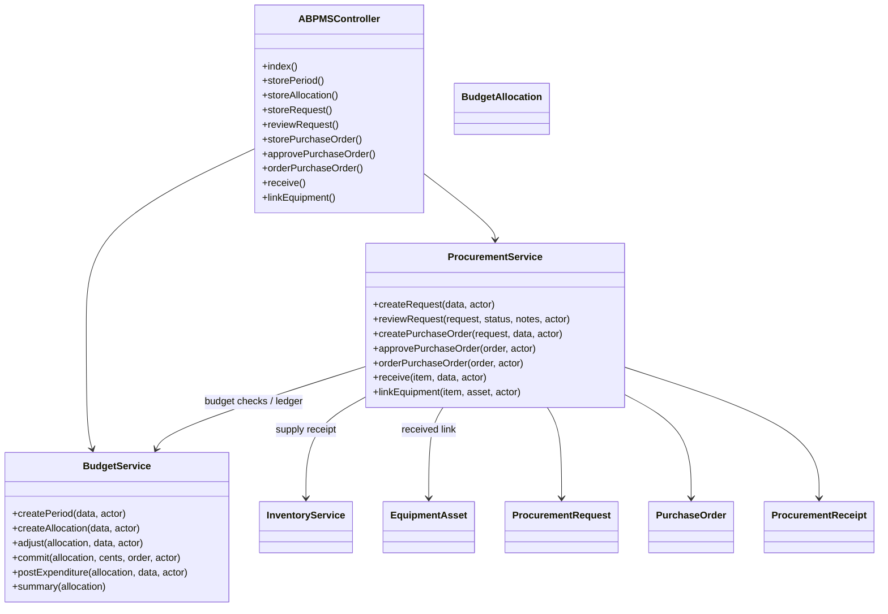
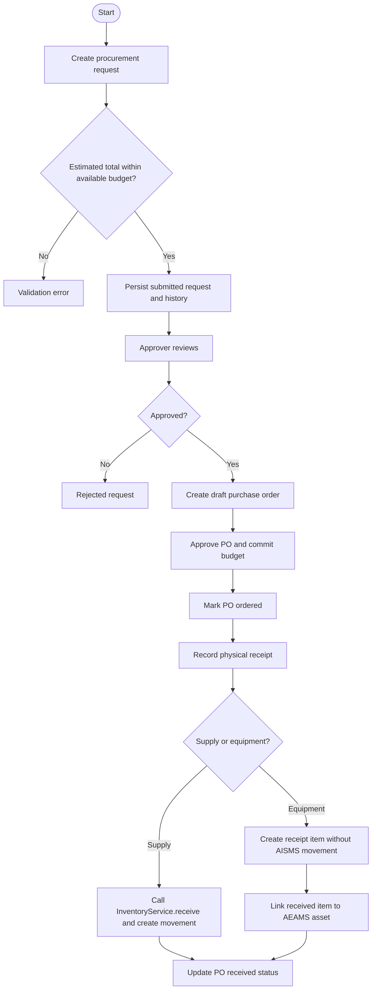
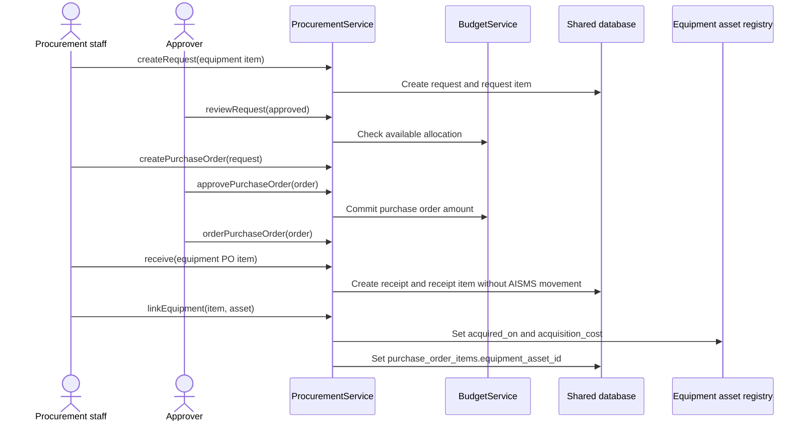

# ABPMS focused diagrams

## Use case

```mermaid
flowchart LR
    Creator[Procurement creator]
    Approver[Authorized approver / MAO]
    Auditor[Auditor]
    Supplier[Supplier]
    subgraph ABPMS["ABPMS inside AgriConnect ERP"]
        Budget((Manage periods and allocations))
        Request((Submit procurement request))
        Review((Review request))
        PO((Create / approve / order PO))
        Receive((Record physical receipt))
        Expenditure((Post budget expenditure))
        Report((Export budget report))
        Link((Link received equipment to AEAMS))
    end
    Creator --> Budget
    Creator --> Request
    Creator --> PO
    Creator --> Receive
    Approver --> Budget
    Approver --> Review
    Approver --> PO
    Approver --> Receive
    Approver --> Expenditure
    Auditor --> Report
    Supplier --> Receive
    Receive --> AISMS[Update AISMS for supply item]
    Receive --> Link
    Link --> AEAMS[Update AEAMS asset acquisition]
```

## Context and Level 1 DFD

```mermaid
flowchart LR
    Staff[Procurement staff]
    Supplier[Supplier delivery]
    P1[Manage budget ledger]
    P2[Create and review request]
    P3[Create, approve and order PO]
    P4[Record physical receipt]
    P5[Link equipment asset]
    D1[(budget periods / allocations / transactions)]
    D2[(requests / items / histories)]
    D3[(purchase orders / items / histories)]
    D4[(receipts / receipt items)]
    D5[(AISMS batches / movements)]
    D6[(AEAMS assets)]
    Staff --> P1 <--> D1
    Staff --> P2 <--> D2
    Staff --> P3 <--> D3
    Supplier --> P4
    Staff --> P4
    P4 <--> D4
    P4 -->|supply item only| D5
    P4 --> P5
    P5 <--> D6
```

## Focused ERD

```mermaid
erDiagram
    BUDGET_PERIODS ||--o{ BUDGET_ALLOCATIONS : contains
    USERS ||--o{ BUDGET_ALLOCATIONS : creates
    BUDGET_ALLOCATIONS ||--o{ BUDGET_TRANSACTIONS : posts
    USERS ||--o{ BUDGET_TRANSACTIONS : performs
    BUDGET_ALLOCATIONS ||--o{ PROCUREMENT_REQUESTS : funds
    USERS ||--o{ PROCUREMENT_REQUESTS : submits
    USERS ||--o{ PROCUREMENT_REQUESTS : reviews
    PROCUREMENT_REQUESTS ||--o{ PROCUREMENT_REQUEST_ITEMS : contains
    SUPPLY_ITEMS ||--o{ PROCUREMENT_REQUEST_ITEMS : describes
    PROCUREMENT_REQUESTS ||--o{ PURCHASE_ORDERS : produces
    PROCUREMENT_SUPPLIERS ||--o{ PURCHASE_ORDERS : supplies
    PURCHASE_ORDERS ||--o{ PURCHASE_ORDER_ITEMS : contains
    PROCUREMENT_REQUEST_ITEMS ||--o{ PURCHASE_ORDER_ITEMS : becomes
    SUPPLY_ITEMS ||--o{ PURCHASE_ORDER_ITEMS : supplies
    EQUIPMENT_ASSETS ||--o| PURCHASE_ORDER_ITEMS : linked_after_receipt
    PURCHASE_ORDERS ||--o{ PROCUREMENT_RECEIPTS : receives
    USERS ||--o{ PROCUREMENT_RECEIPTS : records
    PROCUREMENT_RECEIPTS ||--o{ PROCUREMENT_RECEIPT_ITEMS : contains
    PURCHASE_ORDER_ITEMS ||--o{ PROCUREMENT_RECEIPT_ITEMS : received
    INVENTORY_MOVEMENTS ||--o{ PROCUREMENT_RECEIPT_ITEMS : optional_supply_movement
    INVENTORY_LOCATIONS ||--o{ PROCUREMENT_RECEIPT_ITEMS : stores_supply
    BUDGET_ALLOCATIONS {
        bigint id PK
        string reference UK
        bigint budget_period_id FK
        string program_code
        decimal authorized_amount
        string status
    }
    BUDGET_TRANSACTIONS {
        bigint id PK
        bigint budget_allocation_id FK
        string entry_type
        string direction
        decimal amount
        string reference UK
        bigint purchase_order_id FK
    }
    PROCUREMENT_REQUESTS {
        bigint id PK
        string request_number UK
        bigint budget_allocation_id FK
        bigint requester_id FK
        decimal estimated_total
        string status
        string idempotency_key UK
    }
    PURCHASE_ORDERS {
        bigint id PK
        string purchase_order_number UK
        bigint procurement_request_id FK
        bigint supplier_id FK
        decimal total_amount
        string status
    }
    PURCHASE_ORDER_ITEMS {
        bigint id PK
        bigint purchase_order_id FK
        bigint supply_item_id FK
        bigint equipment_asset_id FK
        decimal ordered_quantity
        decimal received_quantity
    }
    PROCUREMENT_RECEIPTS {
        bigint id PK
        string receipt_reference UK
        bigint purchase_order_id FK
        bigint received_by FK
        string idempotency_key UK
    }
    PROCUREMENT_RECEIPT_ITEMS {
        bigint id PK
        bigint procurement_receipt_id FK
        bigint purchase_order_item_id FK
        decimal quantity
        bigint inventory_movement_id FK
        bigint inventory_location_id FK
    }
```

## UML class view

```mermaid
classDiagram
    class ABPMSController {
        +index()
        +storePeriod()
        +storeAllocation()
        +storeRequest()
        +reviewRequest()
        +storePurchaseOrder()
        +approvePurchaseOrder()
        +orderPurchaseOrder()
        +receive()
        +linkEquipment()
    }
    class BudgetService {
        +createPeriod(data, actor)
        +createAllocation(data, actor)
        +adjust(allocation, data, actor)
        +commit(allocation, cents, order, actor)
        +postExpenditure(allocation, data, actor)
        +summary(allocation)
    }
    class ProcurementService {
        +createRequest(data, actor)
        +reviewRequest(request, status, notes, actor)
        +createPurchaseOrder(request, data, actor)
        +approvePurchaseOrder(order, actor)
        +orderPurchaseOrder(order, actor)
        +receive(item, data, actor)
        +linkEquipment(item, asset, actor)
    }
    class InventoryService
    class BudgetAllocation
    class ProcurementRequest
    class PurchaseOrder
    class ProcurementReceipt
    class EquipmentAsset
    ABPMSController --> BudgetService
    ABPMSController --> ProcurementService
    ProcurementService --> BudgetService : budget checks / ledger
    ProcurementService --> InventoryService : supply receipt
    ProcurementService --> EquipmentAsset : received link
    ProcurementService --> ProcurementRequest
    ProcurementService --> PurchaseOrder
    ProcurementService --> ProcurementReceipt
```

## Activity — supply procurement to AISMS

```mermaid
flowchart TD
    S([Start]) --> Request[Create procurement request]
    Request --> Funds{Estimated total within available budget?}
    Funds -- No --> Reject[Validation error]
    Funds -- Yes --> Submitted[Persist submitted request and history]
    Submitted --> Review[Approver reviews]
    Review --> Approved{Approved?}
    Approved -- No --> Closed[Rejected request]
    Approved -- Yes --> Draft[Create draft purchase order]
    Draft --> POApprove[Approve PO and commit budget]
    POApprove --> Order[Mark PO ordered]
    Order --> Receipt[Record physical receipt]
    Receipt --> Type{Supply or equipment?}
    Type -- Supply --> AISMS[Call InventoryService.receive and create movement]
    Type -- Equipment --> AEAMS[Create receipt item without AISMS movement]
    AEAMS --> Link[Link received item to AEAMS asset]
    AISMS --> Done[Update PO received status]
    Link --> Done
```

## Sequence — equipment procurement link

```mermaid
sequenceDiagram
    actor Staff as Procurement staff
    actor Approver
    participant ABPMS as ProcurementService
    participant Budget as BudgetService
    participant DB as Shared database
    participant AEAMS as Equipment asset registry
    Staff->>ABPMS: createRequest(equipment item)
    ABPMS->>DB: Create request and request item
    Approver->>ABPMS: reviewRequest(approved)
    ABPMS->>Budget: Check available allocation
    Staff->>ABPMS: createPurchaseOrder(request)
    Approver->>ABPMS: approvePurchaseOrder(order)
    ABPMS->>Budget: Commit purchase order amount
    Approver->>ABPMS: orderPurchaseOrder(order)
    Staff->>ABPMS: receive(equipment PO item)
    ABPMS->>DB: Create receipt and receipt item without AISMS movement
    Staff->>ABPMS: linkEquipment(item, asset)
    ABPMS->>AEAMS: Set acquired_on and acquisition_cost
    ABPMS->>DB: Set purchase_order_items.equipment_asset_id
```
