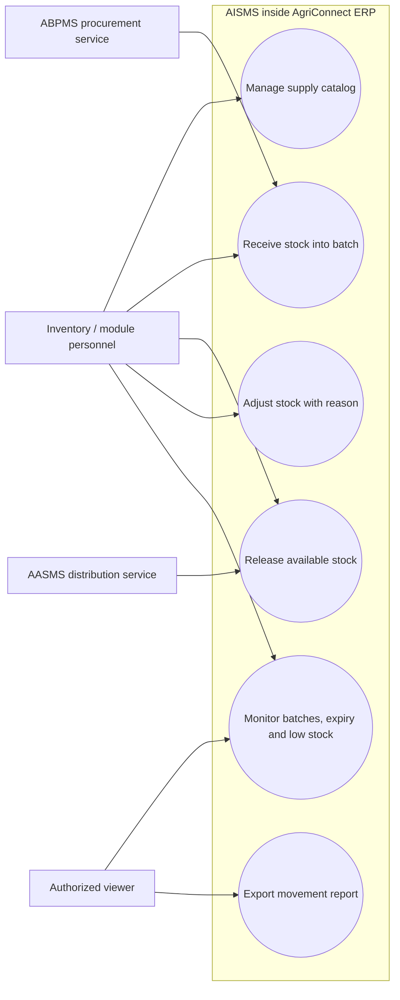
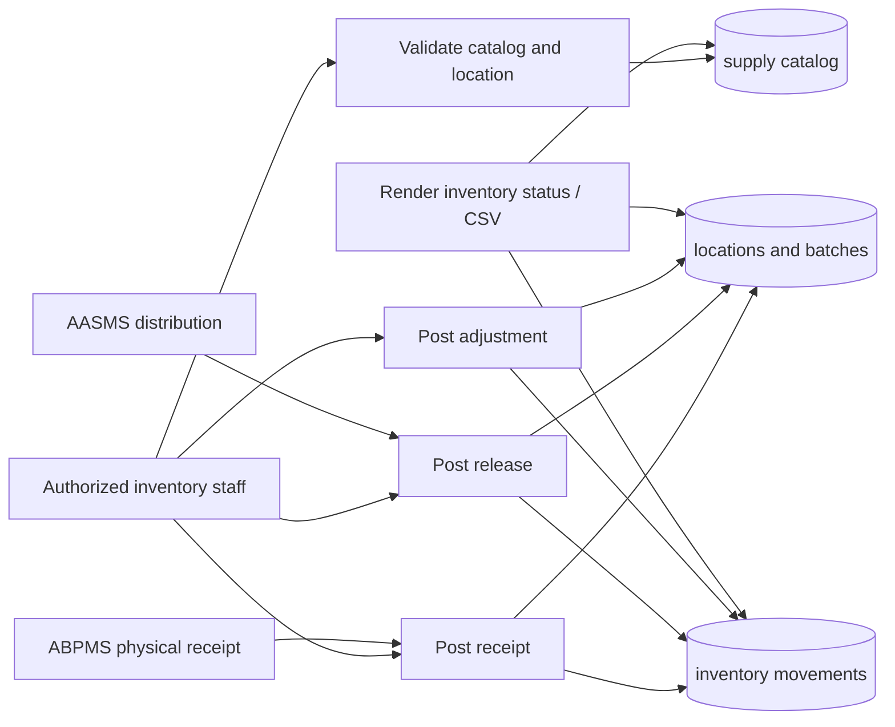
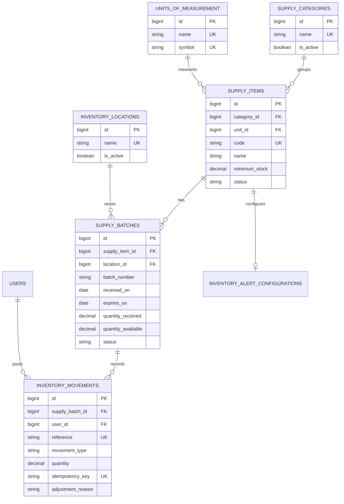
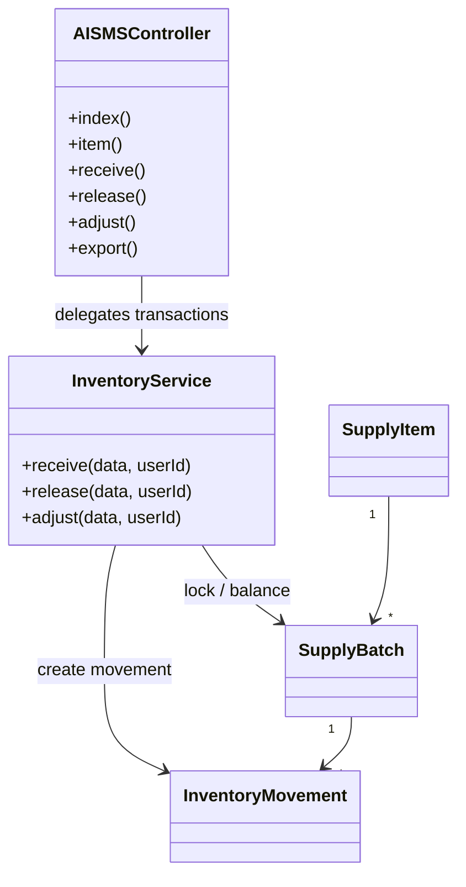
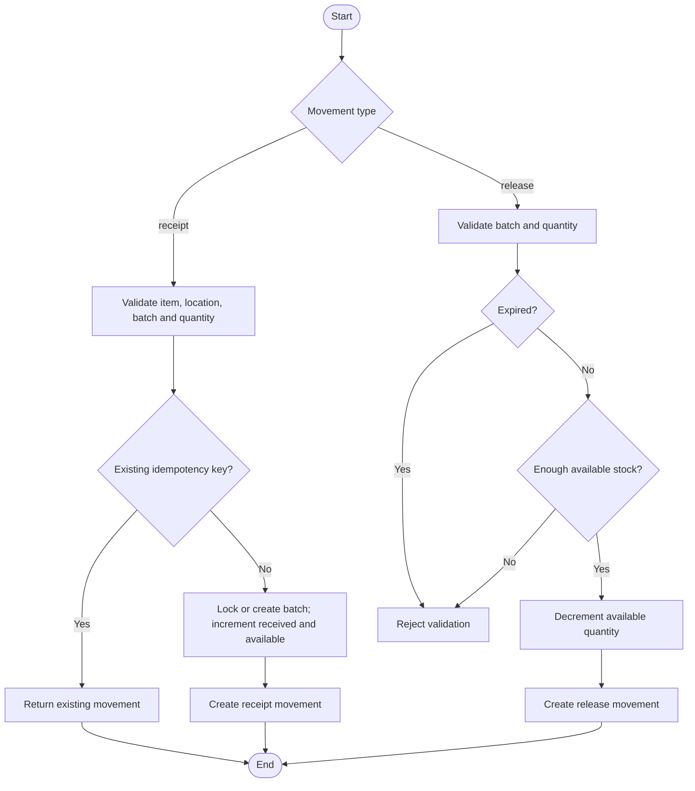
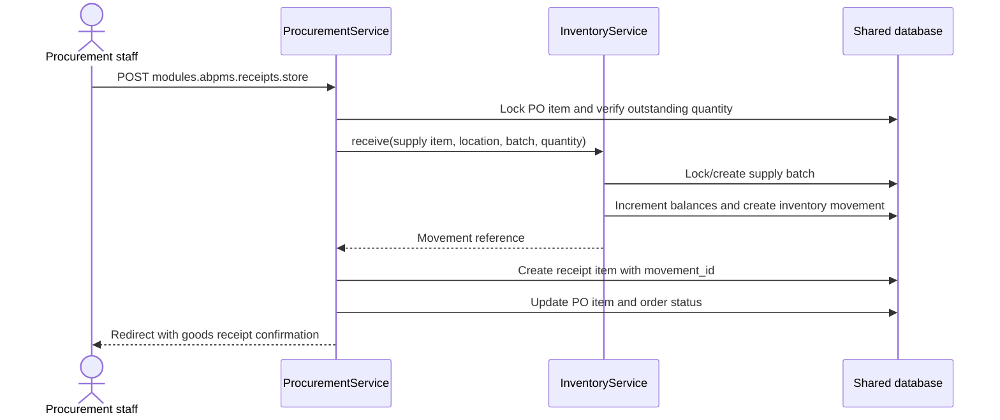

# AISMS focused diagrams

## Use case

```mermaid
flowchart LR
    Personnel[Inventory / module personnel]
    Auditor[Authorized viewer]
    AASMS[AASMS distribution service]
    ABPMS[ABPMS procurement service]
    subgraph AISMS["AISMS inside AgriConnect ERP"]
        Catalog((Manage supply catalog))
        Receive((Receive stock into batch))
        Release((Release available stock))
        Adjust((Adjust stock with reason))
        Monitor((Monitor batches, expiry and low stock))
        Export((Export movement report))
    end
    Personnel --> Catalog
    Personnel --> Receive
    Personnel --> Release
    Personnel --> Adjust
    Personnel --> Monitor
    Auditor --> Monitor
    Auditor --> Export
    AASMS --> Release
    ABPMS --> Receive
```

## Context and Level 1 DFD

```mermaid
flowchart LR
    Staff[Authorized inventory staff]
    AASMS[AASMS distribution]
    ABPMS[ABPMS physical receipt]
    P1[Validate catalog and location]
    P2[Post receipt]
    P3[Post release]
    P4[Post adjustment]
    P5[Render inventory status / CSV]
    D1[(supply catalog)]
    D2[(locations and batches)]
    D3[(inventory movements)]
    Staff --> P1 --> D1
    Staff --> P2
    Staff --> P3
    Staff --> P4
    AASMS --> P3
    ABPMS --> P2
    P2 --> D2
    P2 --> D3
    P3 --> D2
    P3 --> D3
    P4 --> D2
    P4 --> D3
    P5 --> D1
    P5 --> D2
    P5 --> D3
```

## Focused ERD

```mermaid
erDiagram
    SUPPLY_CATEGORIES ||--o{ SUPPLY_ITEMS : groups
    UNITS_OF_MEASUREMENT ||--o{ SUPPLY_ITEMS : measures
    SUPPLY_ITEMS ||--o{ SUPPLY_BATCHES : has
    INVENTORY_LOCATIONS ||--o{ SUPPLY_BATCHES : stores
    SUPPLY_BATCHES ||--o{ INVENTORY_MOVEMENTS : records
    USERS ||--o{ INVENTORY_MOVEMENTS : posts
    SUPPLY_ITEMS ||--o| INVENTORY_ALERT_CONFIGURATIONS : configures
    SUPPLY_CATEGORIES {
        bigint id PK
        string name UK
        boolean is_active
    }
    UNITS_OF_MEASUREMENT {
        bigint id PK
        string name UK
        string symbol UK
    }
    SUPPLY_ITEMS {
        bigint id PK
        bigint category_id FK
        bigint unit_id FK
        string code UK
        string name
        decimal minimum_stock
        string status
    }
    INVENTORY_LOCATIONS {
        bigint id PK
        string name UK
        boolean is_active
    }
    SUPPLY_BATCHES {
        bigint id PK
        bigint supply_item_id FK
        bigint location_id FK
        string batch_number
        date received_on
        date expires_on
        decimal quantity_received
        decimal quantity_available
        string status
    }
    INVENTORY_MOVEMENTS {
        bigint id PK
        bigint supply_batch_id FK
        bigint user_id FK
        string reference UK
        string movement_type
        decimal quantity
        string idempotency_key UK
        string adjustment_reason
    }
```

## UML class view

```mermaid
classDiagram
    class AISMSController {
        +index()
        +item()
        +receive()
        +release()
        +adjust()
        +export()
    }
    class InventoryService {
        +receive(data, userId)
        +release(data, userId)
        +adjust(data, userId)
    }
    class SupplyItem
    class SupplyBatch
    class InventoryMovement
    AISMSController --> InventoryService : delegates transactions
    InventoryService --> SupplyBatch : lock / balance
    InventoryService --> InventoryMovement : create movement
    SupplyItem "1" --> "*" SupplyBatch
    SupplyBatch "1" --> "*" InventoryMovement
```

## Activity — receipt and release

```mermaid
flowchart TD
    S([Start]) --> Action{Movement type}
    Action -->|receipt| Receive[Validate item, location, batch and quantity]
    Receive --> ReceiptKey{Existing idempotency key?}
    ReceiptKey -- Yes --> Existing[Return existing movement]
    ReceiptKey -- No --> Add[Lock or create batch; increment received and available]
    Add --> Movement[Create receipt movement]
    Action -->|release| Release[Validate batch and quantity]
    Release --> Expired{Expired?}
    Expired -- Yes --> Reject[Reject validation]
    Expired -- No --> Enough{Enough available stock?}
    Enough -- No --> Reject
    Enough -- Yes --> Deduct[Decrement available quantity]
    Deduct --> Movement2[Create release movement]
    Movement --> End([End])
    Movement2 --> End
    Existing --> End
```

## Sequence — ABPMS receipt increases AISMS stock

```mermaid
sequenceDiagram
    actor Staff as Procurement staff
    participant ABPMS as ProcurementService
    participant Inventory as InventoryService
    participant DB as Shared database
    Staff->>ABPMS: POST modules.abpms.receipts.store
    ABPMS->>DB: Lock PO item and verify outstanding quantity
    ABPMS->>Inventory: receive(supply item, location, batch, quantity)
    Inventory->>DB: Lock/create supply batch
    Inventory->>DB: Increment balances and create inventory movement
    Inventory-->>ABPMS: Movement reference
    ABPMS->>DB: Create receipt item with movement_id
    ABPMS->>DB: Update PO item and order status
    ABPMS-->>Staff: Redirect with goods receipt confirmation
```
